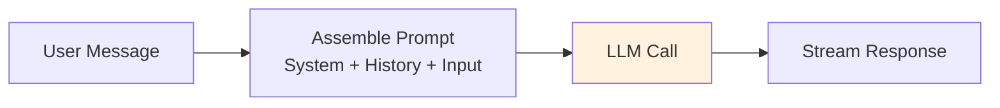
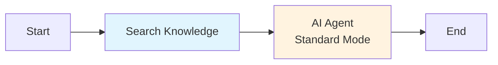

## Overview

**Standard Mode** is the simplest execution mode for the AI Agent Node. The node assembles a prompt from the system message, conversation history, and user input, makes a single LLM call, and returns the response. There are no intermediate reasoning steps, no tool calls, and no self-critique loops.

This is the default mode and should be your starting point for any new workflow. Upgrade to a more complex mode only when Standard does not meet your quality requirements.

## How It Works



<Steps>
  <Step title="Assemble Prompt">
    The node combines the system prompt, conversation history (if memory is enabled), and the current user message into a single prompt.
  </Step>
  <Step title="Call LLM">
    The assembled prompt is sent to the configured model. The response streams token-by-token via SSE `llm_token` events.
  </Step>
  <Step title="Return Response">
    The complete response is written to the workflow context and delivered to the user.
  </Step>
</Steps>

## Configuration

```json
{
  "type": "ai-agent-node",
  "config": {
    "agent_mode": "standard",
    "model": "gpt-4o",
    "system_prompt": "You are a helpful customer support assistant for Nadoo AI. Answer questions clearly and concisely.",
    "temperature": 0.7,
    "max_tokens": 4096
  }
}
```

| Parameter | Type | Default | Description |
|---|---|---|---|
| `agent_mode` | string | -- | Must be `"standard"` |
| `model` | string | -- | Model identifier (e.g., `"gpt-4o"`, `"claude-sonnet-4-20250514"`, `"ollama/llama3"`) |
| `system_prompt` | string | `""` | Instructions that define the agent's behavior and persona |
| `temperature` | float | `0.7` | Controls randomness (0 = deterministic, 2 = highly random) |
| `max_tokens` | int | `4096` | Maximum tokens in the response |

### Additional Model Settings

```json
{
  "agent_mode": "standard",
  "model": "gpt-4o",
  "system_prompt": "You are a translator.",
  "temperature": 0.3,
  "max_tokens": 2048,
  "top_p": 0.9,
  "frequency_penalty": 0.2,
  "presence_penalty": 0.1,
  "stop_sequences": ["---"]
}
```

| Parameter | Type | Default | Description |
|---|---|---|---|
| `top_p` | float | `1.0` | Nucleus sampling threshold |
| `frequency_penalty` | float | `0.0` | Penalize frequently appearing tokens (-2.0 to 2.0) |
| `presence_penalty` | float | `0.0` | Penalize tokens that have appeared at all (-2.0 to 2.0) |
| `stop_sequences` | string[] | `[]` | Sequences that cause the model to stop generating |

## SSE Events

Standard mode emits the following events during execution:

| Event | When | Payload |
|---|---|---|
| `node_started` | Node begins execution | `{ node_id, node_type }` |
| `llm_token` | Each token is generated | `{ token, node_id }` |
| `llm_finished` | LLM generation completes | `{ node_id, total_tokens }` |
| `node_finished` | Node completes | `{ node_id, status }` |

Standard mode does **not** emit `llm_thinking`, `llm_tool_call`, or `agent_reflection` events.

## Use Cases

<CardGroup cols={2}>
  <Card title="Simple Q&A" icon="circle-question">
    Answer user questions based on the system prompt and conversation history. No external data or tools needed.
  </Card>
  <Card title="Content Generation" icon="pen-nib">
    Generate blog posts, emails, marketing copy, or other text content from a prompt.
  </Card>
  <Card title="Translation" icon="language">
    Translate text between languages. Set a low temperature (0.2-0.3) for consistent, accurate translations.
  </Card>
  <Card title="Summarization" icon="compress">
    Summarize documents, articles, or conversation threads. Works well when the full text fits within the context window.
  </Card>
  <Card title="Classification" icon="tags">
    Classify text into categories (sentiment, topic, language). Pair with a Condition Node downstream to branch on the result.
  </Card>
  <Card title="Formatting & Extraction" icon="filter">
    Reformat data, extract structured fields from unstructured text, or convert between formats (JSON, CSV, Markdown).
  </Card>
</CardGroup>

## Example: RAG with Standard Mode

Standard mode works well for RAG workflows where the knowledge retrieval is handled by upstream nodes:



The Search Knowledge Node retrieves relevant context, and the AI Agent Node in Standard mode uses that context to generate a response. No complex reasoning or tool use is needed because the retrieval is already done.

### System Prompt for RAG

```
You are a knowledge base assistant. Answer the user's question based on the following retrieved context. If the context does not contain relevant information, say "I don't have information about that."

Context:
{{search_results}}
```

## Performance Characteristics

| Metric | Standard Mode |
|---|---|
| LLM calls per execution | 1 |
| Latency | Lowest (single round-trip) |
| Token usage | Lowest (no overhead from reasoning, reflection, or tool calls) |
| Quality ceiling | Moderate (limited by single-pass generation) |

<Info>
  Standard mode is typically **2-5x faster** and **2-5x cheaper** than multi-step modes like ReAct or Tree of Thoughts. Always benchmark Standard mode first before moving to a more complex strategy.
</Info>

## When to Upgrade

Consider switching to a more advanced mode when:

- **Accuracy on reasoning tasks is poor** -- Try [Chain of Thought](/workflow/strategies/chain-of-thought) for step-by-step reasoning.
- **The agent needs to call tools** -- Use [ReAct](/workflow/strategies/react) or Function Calling mode.
- **Output quality needs iterative improvement** -- Use [Reflection](/workflow/strategies/reflection) for self-critique.
- **Multiple approaches should be explored** -- Use [Tree of Thoughts](/workflow/strategies/tree-of-thoughts) for parallel reasoning.

## Best Practices

<AccordionGroup>
  <Accordion title="Write detailed system prompts">
    In Standard mode, the system prompt is your primary lever for controlling output quality. Be specific about the desired format, tone, length, and any constraints.
  </Accordion>
  <Accordion title="Use low temperature for factual tasks">
    Set temperature to 0.0-0.3 for translation, extraction, and factual Q&A. Use 0.7-1.0 for creative tasks where variety is desirable.
  </Accordion>
  <Accordion title="Leverage upstream context">
    Use Search Knowledge, Database, or Variable Nodes upstream to provide the AI Agent with all the context it needs. Standard mode excels when the input is well-prepared.
  </Accordion>
  <Accordion title="Set appropriate max_tokens">
    Avoid using very large `max_tokens` values for tasks that need short answers. This wastes budget on unused capacity and can lead to unnecessarily verbose responses.
  </Accordion>
</AccordionGroup>

## Next Steps

<CardGroup cols={2}>
  <Card title="Chain of Thought" icon="list-ol" href="/workflow/strategies/chain-of-thought">
    Add step-by-step reasoning for complex problems
  </Card>
  <Card title="ReAct Mode" icon="arrows-spin" href="/workflow/strategies/react">
    Enable tool use with iterative reasoning
  </Card>
  <Card title="AI Agent Node" icon="robot" href="/workflow/nodes/ai-agent">
    Full configuration reference for all modes
  </Card>
  <Card title="Strategies Overview" icon="lightbulb" href="/workflow/strategies/overview">
    Compare all 6 execution modes
  </Card>
</CardGroup>
