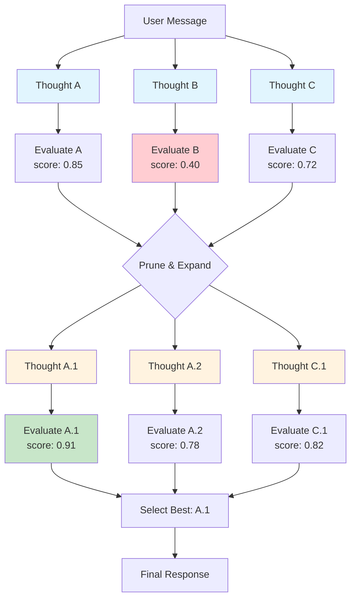

## Overview

**Tree of Thoughts (ToT)** is the most sophisticated execution mode in Nadoo AI. Instead of following a single reasoning path, it generates **multiple independent reasoning paths in parallel**, evaluates each path, prunes unpromising ones, and expands the most promising paths deeper. The best complete path is selected as the final response.

This mode is designed for problems where there are multiple valid approaches and the optimal one is not obvious upfront. By exploring several paths simultaneously, ToT finds solutions that linear reasoning might miss.

## How It Works



<Steps>
  <Step title="Generate Initial Thoughts">
    The LLM generates `num_thoughts` independent reasoning paths at the first level. Each thought represents a different approach to the problem.
  </Step>
  <Step title="Evaluate">
    Each thought is scored using the configured `evaluation_strategy` (numeric scoring or pairwise voting).
  </Step>
  <Step title="Prune">
    Thoughts scoring below `pruning_threshold` (relative to the max score) are discarded. This focuses computational resources on the most promising paths.
  </Step>
  <Step title="Expand">
    Surviving thoughts are expanded to the next depth level. Each thought generates `num_thoughts` child thoughts, continuing the reasoning deeper.
  </Step>
  <Step title="Select Best">
    After reaching the configured `depth`, the highest-scoring complete path is selected, and its result becomes the final response.
  </Step>
</Steps>

## Configuration

```json
{
  "type": "ai-agent-node",
  "config": {
    "agent_mode": "tree_of_thoughts",
    "model": "gpt-4o",
    "system_prompt": "You are a strategic planning advisor. Explore multiple approaches thoroughly before recommending the best one.",
    "tot_config": {
      "num_thoughts": 3,
      "depth": 2,
      "evaluation_strategy": "vote",
      "pruning_threshold": 0.3
    },
    "temperature": 0.8,
    "max_tokens": 8192
  }
}
```

| Parameter | Type | Default | Description |
|---|---|---|---|
| `agent_mode` | string | -- | Must be `"tree_of_thoughts"` |
| `tot_config.num_thoughts` | number | `3` | Number of parallel reasoning paths at each level |
| `tot_config.depth` | number | `2` | Number of levels to explore in the tree |
| `tot_config.evaluation_strategy` | string | `"vote"` | How to score paths: `"score"` or `"vote"` |
| `tot_config.pruning_threshold` | float | `0.3` | Minimum score relative to max to survive pruning |

## Configuration Parameters in Depth

### num_thoughts

Controls the **breadth** of exploration at each level. More thoughts means more approaches are considered, but each additional thought adds LLM calls.

| Value | Behavior | LLM Calls (approx.) |
|---|---|---|
| 2 | Two alternatives explored | Moderate |
| 3 | Three alternatives (recommended) | Good balance |
| 5 | Five alternatives | High cost, thorough exploration |

### depth

Controls how **deep** the reasoning goes. Each depth level refines and extends the thoughts from the previous level.

| Value | Behavior |
|---|---|
| 1 | Generate and evaluate thoughts, select the best (no expansion) |
| 2 | Generate, evaluate, expand the best, evaluate again, select (recommended) |
| 3 | Three levels of exploration (expensive, use for complex problems only) |

### evaluation_strategy

<Tabs>
  <Tab title="Score">
    ### Score-Based Evaluation

    The LLM assigns a numeric score (0.0-1.0) to each thought based on how promising it is.

    ```json
    {
      "evaluation_strategy": "score"
    }
    ```

    **How it works:** Each thought is evaluated independently with a prompt like "Rate this approach on a scale of 0 to 1 based on feasibility, creativity, and completeness."

    **Pros:** Fast (one LLM call per thought), deterministic scoring.
    **Cons:** Scores may not be well-calibrated across different thoughts.
  </Tab>
  <Tab title="Vote">
    ### Vote-Based Evaluation

    Thoughts are compared pairwise, and each comparison produces a "vote" for the better approach. The thought with the most votes wins.

    ```json
    {
      "evaluation_strategy": "vote"
    }
    ```

    **How it works:** Every pair of thoughts is presented to the LLM with the prompt "Which approach is better and why?" The winning approach in each comparison receives a vote.

    **Pros:** More robust ranking, handles calibration issues better.
    **Cons:** More LLM calls (N*(N-1)/2 comparisons for N thoughts), higher cost.
  </Tab>
</Tabs>

### pruning_threshold

Controls how aggressively underperforming paths are pruned. The threshold is relative to the maximum score at that level.

| Threshold | Behavior |
|---|---|
| `0.0` | No pruning -- all thoughts advance to the next level |
| `0.3` | Moderate pruning -- thoughts scoring below 30% of the max are dropped |
| `0.5` | Aggressive pruning -- only the top half survive |
| `0.8` | Very aggressive -- only near-best thoughts survive |

**Example with `pruning_threshold: 0.3`:**

If thought scores are [0.85, 0.40, 0.72], the max is 0.85. The threshold cutoff is 0.85 * 0.3 = 0.255. Since all scores exceed 0.255, all thoughts survive. But if one thought scored 0.20, it would be pruned.

## SSE Events

Tree of Thoughts mode emits these events:

| Event | When | Payload |
|---|---|---|
| `node_started` | Node begins | `{ node_id }` |
| `agent_thinking` | Each thought is generated | `{ thought_id, depth, content, node_id }` |
| `agent_thinking` | Each thought is evaluated | `{ thought_id, depth, score, node_id }` |
| `agent_thinking` | Pruning decision | `{ pruned_thoughts, surviving_thoughts, depth, node_id }` |
| `llm_token` | Each token generated | `{ token, node_id }` |
| `llm_finished` | Best path selected | `{ node_id, total_tokens, winning_path }` |
| `node_finished` | Node completes | `{ node_id, status }` |

The `agent_thinking` event is used throughout the ToT process to communicate the tree exploration to the client. Clients can use these events to visualize the branching thought process.

## Example: Strategic Planning

A user asks: "How should we expand our product into the Japanese market?"

### Level 1: Three Initial Approaches

```
Thought A: Partnership Strategy
Form strategic partnerships with established Japanese companies
for distribution and localization...

Thought B: Direct Entry Strategy
Establish a local office in Tokyo, hire a local team, and
build direct customer relationships...

Thought C: Digital-First Strategy
Launch online with Japanese localization, use digital marketing
and social media to build brand awareness before physical presence...
```

### Evaluation

```
Thought A: score 0.82 (strong local knowledge, lower risk, shared control)
Thought B: score 0.65 (full control, high cost, slow start)
Thought C: score 0.78 (fast launch, lower cost, limited market depth)
```

### Level 2: Expand Top Paths

```
Thought A.1: Partnership with a major tech distributor + localized
product with Japanese-first support...

Thought A.2: Partnership with a consulting firm for enterprise
sales channel...

Thought C.1: Digital launch targeting SMBs with freemium model
+ social media presence...
```

### Final Selection

```
Best path: Thought A.1 (score 0.91)
-- Partnership with tech distributor provides immediate market access
with localized product and support.
```

## Example: Creative Writing

```json
{
  "agent_mode": "tree_of_thoughts",
  "model": "gpt-4o",
  "system_prompt": "You are a creative writing advisor. Explore multiple narrative approaches before recommending the most compelling one.",
  "tot_config": {
    "num_thoughts": 3,
    "depth": 2,
    "evaluation_strategy": "vote"
  },
  "temperature": 0.9
}
```

The high temperature encourages diverse initial thoughts, while the vote-based evaluation ensures the most compelling narrative is selected.

## Computational Cost

Tree of Thoughts is the most expensive mode. The total number of LLM calls grows with both `num_thoughts` and `depth`:

| Phase | LLM Calls |
|---|---|
| Level 1 generation | `num_thoughts` |
| Level 1 evaluation (score) | `num_thoughts` |
| Level 1 evaluation (vote) | `num_thoughts * (num_thoughts - 1) / 2` |
| Level 2 generation | `surviving_thoughts * num_thoughts` |
| Level 2 evaluation | Same as Level 1 for expanded thoughts |
| Final synthesis | 1 |

**Example with default config** (3 thoughts, depth 2, vote evaluation):

- Level 1: 3 generations + 3 comparisons = 6 calls
- Level 2 (assuming 2 survive): 6 generations + 15 comparisons = 21 calls
- Final: 1 call
- **Total: ~28 LLM calls**

<Warning>
  The cost grows rapidly. A configuration of `num_thoughts: 5, depth: 3` with vote evaluation can result in 100+ LLM calls. Use this mode judiciously and only for high-value decisions.
</Warning>

## Performance Characteristics

| Metric | Tree of Thoughts |
|---|---|
| LLM calls per execution | 10-50+ depending on configuration |
| Latency | Very High (many sequential and parallel LLM calls) |
| Token usage | 5-20x Standard |
| Quality ceiling | Highest (explores multiple approaches) |

## When to Use Tree of Thoughts

| Scenario | Recommended? | Why |
|---|---|---|
| Strategic business decisions | Yes | Multiple valid approaches worth exploring |
| Creative content with multiple angles | Yes | Diverse perspectives improve quality |
| Complex problem with no clear path | Yes | Exploration prevents premature commitment |
| Simple Q&A or factual retrieval | No | Massive overkill, use Standard |
| Time-sensitive responses | No | Too slow for real-time interaction |
| Budget-constrained workflows | No | Token cost is very high |

## Best Practices

<AccordionGroup>
  <Accordion title="Start with num_thoughts: 3 and depth: 2">
    This is the recommended starting point. It explores 3 approaches with one level of refinement -- a good balance of exploration and cost. Increase only after confirming that broader/deeper exploration yields meaningfully better results.
  </Accordion>
  <Accordion title="Use vote evaluation for subjective tasks">
    Pairwise voting is more robust than numeric scoring for creative, strategic, or subjective tasks where absolute scores are hard to calibrate. Use score-based evaluation for more objective, measurable criteria.
  </Accordion>
  <Accordion title="Set higher temperature for initial generation">
    Use temperature 0.7-0.9 for ToT to encourage diverse initial thoughts. If all three initial thoughts are similar, the mode loses its advantage over Chain of Thought.
  </Accordion>
  <Accordion title="Reserve for high-value outputs">
    Given the computational cost, use ToT only for decisions or outputs where exploring multiple paths provides clear value: strategy documents, architecture decisions, creative campaigns.
  </Accordion>
  <Accordion title="Combine with other modes in a workflow">
    Use ToT for the critical decision point, and Standard or Chain of Thought for surrounding nodes. For example: Standard for intake, ToT for strategy generation, Reflection for polishing the output.
  </Accordion>
</AccordionGroup>

## Next Steps

<CardGroup cols={2}>
  <Card title="Standard Mode" icon="bolt" href="/workflow/strategies/standard">
    The simplest mode for comparison
  </Card>
  <Card title="Chain of Thought" icon="list-ol" href="/workflow/strategies/chain-of-thought">
    Linear step-by-step reasoning
  </Card>
  <Card title="Reflection Mode" icon="rotate" href="/workflow/strategies/reflection">
    Self-critique for output refinement
  </Card>
  <Card title="Strategies Overview" icon="lightbulb" href="/workflow/strategies/overview">
    Compare all 6 execution modes
  </Card>
</CardGroup>
